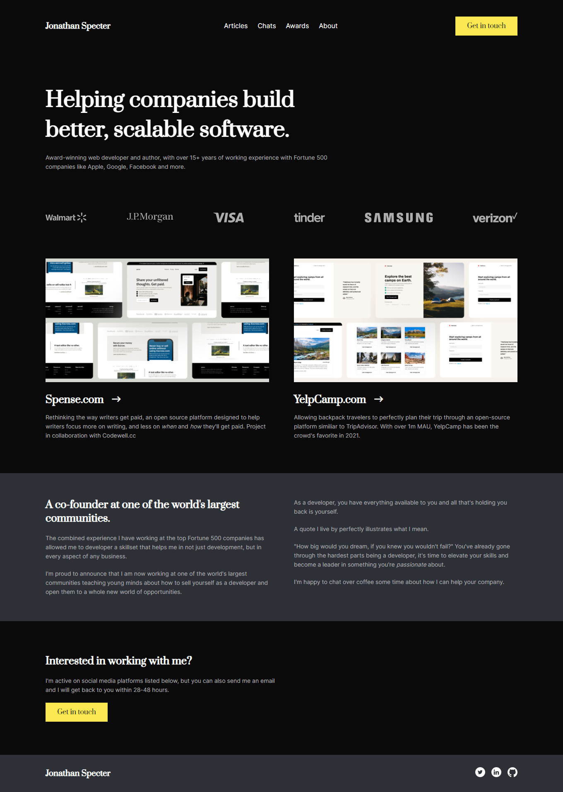
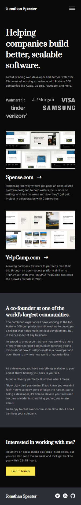

# Codewell - Web developer portfolio solution

This is a solution to the [Web Developer Portfolio Challenge on Codewell](https://www.codewell.cc/challenges/web-developer-portfolio--617d4897a383e41090a3e46f). Codewell's aim is to provide you with real-world design templates that you can use to practice your HTML and CSS projects. Free or paid, all templates are high quality and will make great portfolio pieces.

## Table of contents

- [Overview](#overview)
  - [The challenge](#the-challenge)
  - [Screenshot](#screenshot)
  - [Links](#links)
- [My process](#my-process)
  - [Built with](#built-with)
- [Author](#author)

## Overview

### The challenge

Users should be able to:

- View the optimal layout for the site depending on their device's screen size
- See hover states for all interactive elements on the page

### Screenshot

### Links

- Solution URL: [https://github.com/michaeljohnson-mj/codewell-web-dev-portfolio.git](https://github.com/michaeljohnson-mj/codewell-web-dev-portfolio.git)
- Live Site URL: [https://michaeljohnson-mj.github.io/codewell-web-dev-portfolio/](https://michaeljohnson-mj.github.io/codewell-web-dev-portfolio/)

## My process

### Built with

- Semantic HTML5 markup
- CSS custom properties
- Flexbox
- CSS Grid
- JavaScript

## Author

- Website - [https://www.michaeljohnson.tech](https://www.michaeljohnson.tech)
- Frontend Mentor - [https://www.frontendmentor.io/profile/michaeljohnson-mj](https://www.frontendmentor.io/profile/michaeljohnson-mj)

